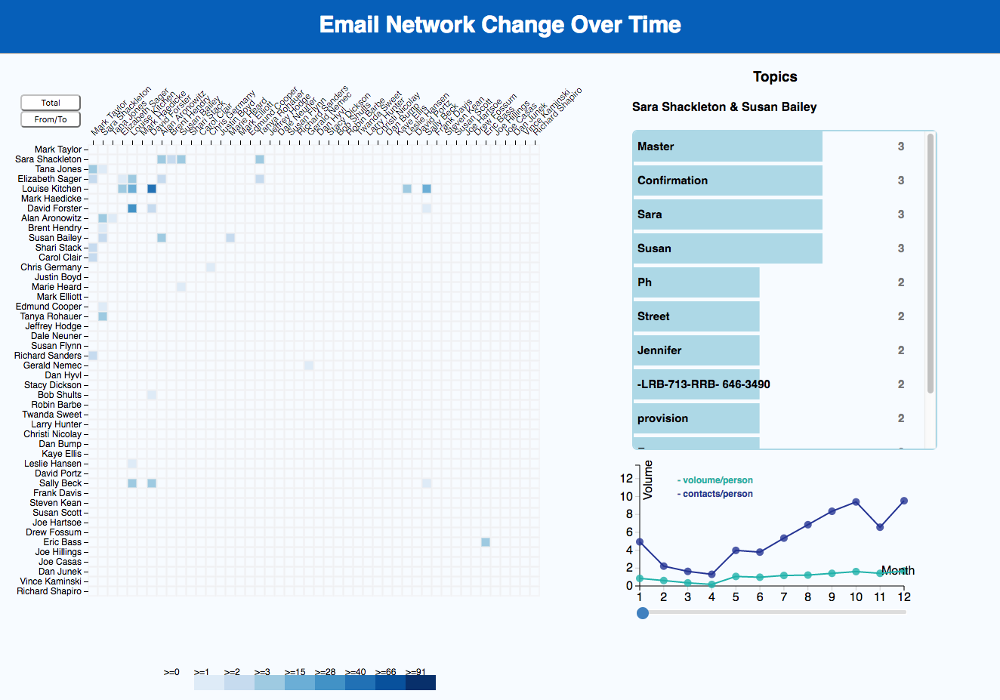

# Email-Net-Over-Time-20

* Link : [https://bw1332.github.io/VisualizationProj/](https://bw1332.github.io/VisualizationProj/)
* Video Demo : [https://vimeo.com/196754153]( https://vimeo.com/196754153)
* Source Code : [source](https://github.com/NYU-CS6313-Fall16/Email-Net-Over-Time-20/tree/master/source)
* Report Document :

Team Members: [Bo Wang](https://github.com/bw1332), [Cheng Ma](https://github.com/tmxk2012197), [Hao Dong](https://github.com/FEhao), [Yulin Shen](https://github.com/Fancylynn)

### Description
Email is one of the most frequently used ways to communicate with others. Our project is to visualize the social network created by given email dataset over time. The visualization shows both volume and content change during specified time intervals. There are mainly three views in our visualization.

1. **Heatmap**

  Consider about the communication pattern of emails, Heatmap is a quite clear way to show the relations among contacts in our email dataset. The blocks in the heatmap represents the amount of communications between the two persons. The darker the block is, the more the emails they sent or received. There are two angles to observe this part of data. The "total" button represents the total number of sending and receiving between two persons. The "from/to" button represent the number of sending emails from one to the other. Comparing these two angles we could have chance to find the roles they played in their communications. The heatmap shows the data for the given month, it could be changed by user using the slider.

2. **Line chart**

  Line chart is to show how the volumes of emails per person and contacts per peroson change in the given year. The light green line represents the volumes of emails, and the dark blue line represents the number of contacts that involved in the certain month. It is interesting to find that there were more and more people join the email network during the year, but average sending/receiving didn't change much.

  The slider under the line chart allows user to change the month.

3. **Bar chart**

  When user clicks the blocks in the heat map, the bar chart shows the topics between these two persons in the given month. The topics are extracted from the content of their emails, which could help us a lot to understand what they are talking about and why the communications changes.

### Code Structure

  * index.html is the entry of the project. It has dependency on D3.js version 3.
  * P2PHeatmap.js is to draw heatmap and it works with heatmapStyle.css.
  * linechart.js is to draw the line chart.
  * barchart.js is to draw bar chart.
  * legendBar.js is to draw slider.
  * util.js provides some helper functions to format given data.

### Data Source

We use open emails in year 2000. The profiled data could be fetched at [link](https://raw.githubusercontent.com/bw1332/VisualizationProj/master/source/fii.json)
or [link](https://rawgit.com/bw1332/VisualizationProj/master/source/fii.json).
